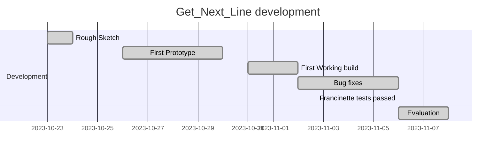

<div align = "center">

# Get Next Line


___


</div>

<div align = "center">

# Timeline


</div>

___

# About the project

get_next_line is one of the 3 projects that the 42 student can do after completing the first project [libft](https://github.com/mota494/42_libft) and for me the 3rd project of the common core.

The code starts with the function `char *get_next_line(int fd)`
```c
char	*get_next_line(int fd)
{
	char	*toret;

	if (fd < 0 || BUFFER_SIZE < 1)
		return (0);
	toret = malloc(1);
	if (!toret)
		return (0);
	toret[0] = '\0';
	return (ft_read_line(fd, toret));
}
```
There isn't much to explain here, I create the variable `toret` the string that i'll return then i do a check to the **file descriptor** and the **BUFFER SIZE** so i can proced with the initialization of the toret variable.

The next function in the project is `ft_read_line`
```c
char	*ft_read_line(int fd, char *toret)
{
	static char	buffer[BUFFER_SIZE];
	char		*next;
	int			bytesread;

	bytesread = 0;
	while (buffer[bytesread] != '\0' && bytesread < BUFFER_SIZE)
		bytesread++;
	while (ft_hasnl(toret) == 0)
	{
		if (ft_is_empty(buffer))
			bytesread = read(fd, buffer, BUFFER_SIZE);
		if (bytesread <= 0)
			break ;
		next = ft_buffer_to_str(buffer, bytesread);
		if (!next)
			break ;
		toret = ft_strjoin(toret, next);
		if (!toret)
			return (NULL);
		free(next);
		ft_cleanbuffer(buffer);
	}
	return (ft_treat_line(toret, bytesread));
}
```
This function creates the static variable **buffer** which is the one that will keep all the values not used in the return variable, the variable **next** which is used to store the next string that will be added to line that will be returned and finnally the **bytesread** variable that it's to store how much information the function **read()** read.

After the inatialization of the variables that needed I proceed to checking how many bytes are left from previous function calls, with this i can later use to write those bytes to my return variable.

After that cycle i start yet another cycle that will run untill the variable that will be returned `toret` has a new line
```c
if (ft_is_empty(buffer))
  bytesread = read(fd, buffer, BUFFER_SIZE);
```
it all starts with checking wether or not buffer is empty or not, if it is it reads and receives new information to be saved
```c
next = ft_buffer_to_str(buffer, bytesread);
if (!next)
  break ;
```
next will take on the value buffer, i use this variable and not buffer directly because using buffer directly can cause some memory errors
```c
toret = ft_strjoin(toret, next);
if (!toret)
  return (NULL);
free(next);
ft_cleanbuffer(buffer);
```
after that toret gets his new values after the old ones, the next variable is freed and the buffer deletes the values that doesn't need anymore
```c
char	*ft_treat_line(char *toret, int bytesread)
{
	if (ft_strlen(toret) && bytesread != -1)
		return (toret);
	free(toret);
	return (NULL);
}
```
after this before returning my variable i go to this function to see if everything is right in the toret variable
