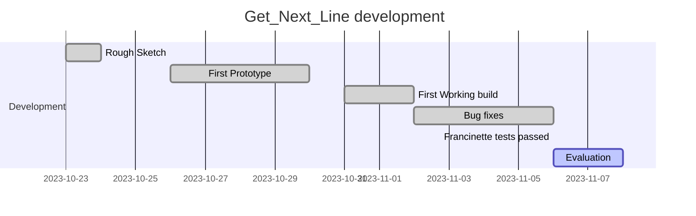

# Get Next Line

___

# Timeline

```mermaid
gantt
dateFormat DD-MM-YYYY
title Get_Next_Line development

section Development
Rough Sketch            :done,    des1, 23-10-2023,24-10-2023
First Prototype         :done,    des2, 26-10-2023,30-10-2023
First Working build     :done,    des3, 31-10-2023,02-11-2023
Bug fixes               :done,    des4, 02-11-2023,06-11-2023
Francinette tests passed :done,   des5, 06-11-2023,06-11-2023
Evaluation              :active,  des6, 06-11-2023, 2d
```

